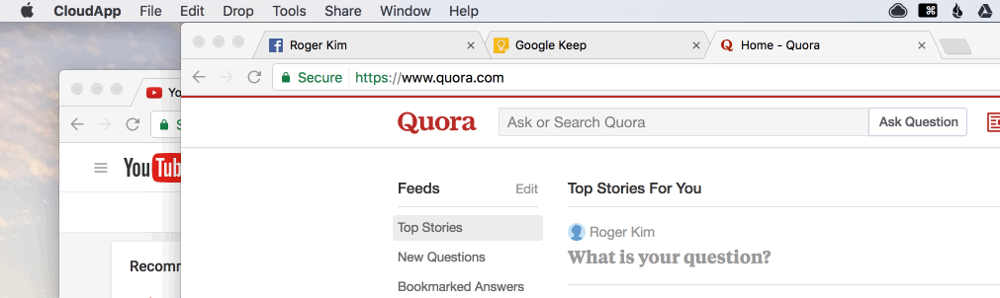
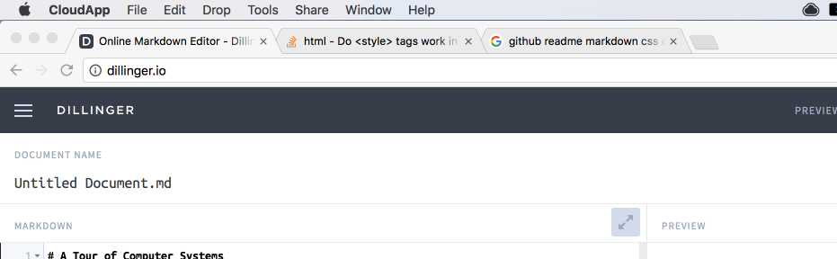
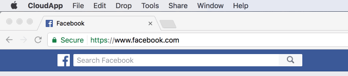

# Keeptabs
    "Keep tabs on your tabs!" - Jemmin Chang

* **Navigate your tabs using hotkeys** (quicker than you ever could with
your mouse!)
* **Stop making tabs of websites that you already have open** (you don't need 7
        facebook tabs open!)
* **Stop searching through the haystack of tabs** (especially when they're too thin
        to even show a logo!)

## Need to...

### Switch to your usual websites? Press the hotkeys that you set!

 
 
 
 
 

### Go back to your previous tab? Use Spacebar as your hotkey!

 
 
 
 
 

### Make a new tab of an open website? Add shift to your hotkey!

## How to...

### Install

1. Download extension from the Google Chrome Web Store (it's free!)
1. Restart Google Chrome
1. Set up your hotkeys in the options page
TODO: Insert gif

### Use

TODO: Insert gif
1. Make sure your browser is not focused on any text input
1. Hold down the _hold key_ (which is set to Escape by default)
1. Type your hotkey (if you want to create a duplicate tab of a website you
   already have open, hope down shift while doing this step)
1. Release the _hold key_

**NOTE:** If you are going to use the default _hold key_ (which is Escape), we
highly recommend setting your computer so that your Caps Lock key registers as
the Escape key. This is especially good to do if you are a Vim or an Emacs user
as those editors use Escape a lot and Caps Lock is easier to reach.
TODO: Insert instructions on how to do this for various OS
